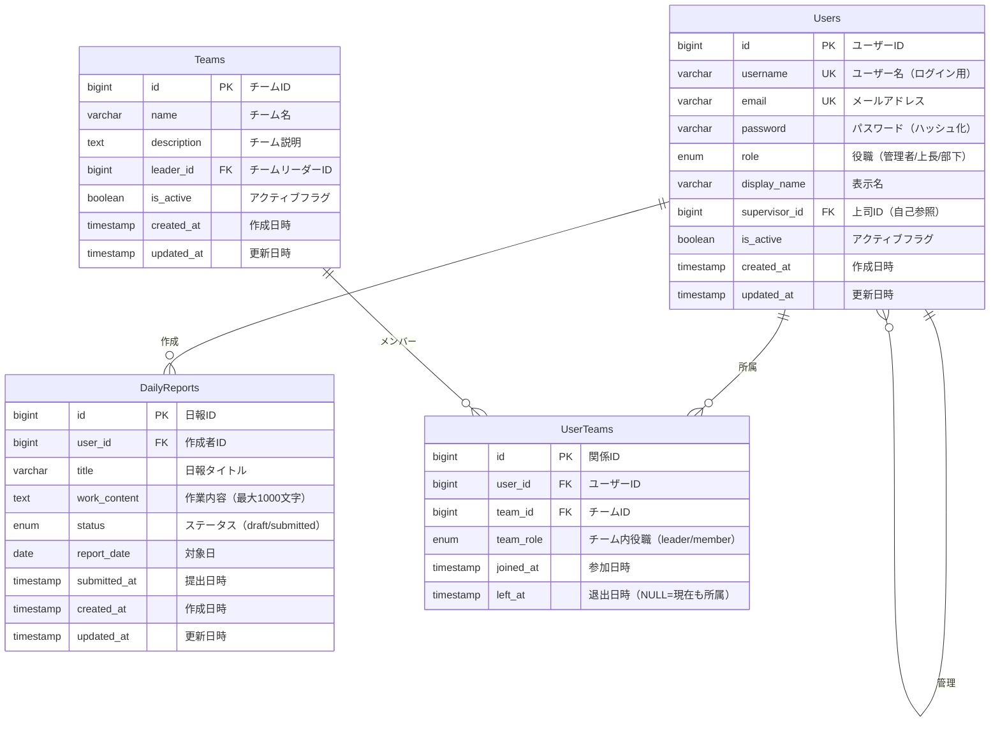

# データベース設計書

## 概要

日報管理システムの実装済み機能を基に設計されたデータベーススキーマです。

## 実装済み機能からの要件

### ユーザー管理
- JWT認証によるログイン機能
- ユーザー役職管理（管理者/上長/部下）
- ユーザー情報表示（ID、ユーザー名、メール、役職）

### 日報管理
- 個人日報の作成・編集・削除
- 作業内容の記録（最大1000文字）
- ステータス管理（下書き/提出済み）
- 作成日・提出日の記録

### 上司機能
- 部下の日報一覧表示
- チーム単位での日報管理
- ステータス別フィルタリング

## ER図



## テーブル詳細設計

### 1. Users（ユーザー）

| カラム名 | データ型 | 制約 | 説明 |
|---------|---------|------|------|
| id | BIGINT | PK, AUTO_INCREMENT | ユーザーID |
| username | VARCHAR(50) | NOT NULL, UNIQUE | ログイン用ユーザー名 |
| email | VARCHAR(255) | UNIQUE | メールアドレス |
| password | VARCHAR(255) | NOT NULL | BCryptハッシュ化パスワード |
| role | ENUM('管理者', '上長', '部下') | NOT NULL, DEFAULT '部下' | ユーザー役職 |
| display_name | VARCHAR(100) | | 表示用名前 |
| supervisor_id | BIGINT | FK(Users.id) | 直属の上司ID |
| is_active | BOOLEAN | NOT NULL, DEFAULT TRUE | アクティブフラグ |
| created_at | TIMESTAMP | NOT NULL, DEFAULT CURRENT_TIMESTAMP | 作成日時 |
| updated_at | TIMESTAMP | NOT NULL, DEFAULT CURRENT_TIMESTAMP ON UPDATE CURRENT_TIMESTAMP | 更新日時 |

#### インデックス
- PRIMARY KEY (id)
- UNIQUE KEY uk_username (username)
- UNIQUE KEY uk_email (email)
- KEY idx_supervisor_id (supervisor_id)
- KEY idx_role (role)

#### 制約
- FOREIGN KEY (supervisor_id) REFERENCES Users(id)

### 2. DailyReports（日報）

| カラム名 | データ型 | 制約 | 説明 |
|---------|---------|------|------|
| id | BIGINT | PK, AUTO_INCREMENT | 日報ID |
| user_id | BIGINT | NOT NULL, FK(Users.id) | 作成者ID |
| title | VARCHAR(200) | NOT NULL | 日報タイトル |
| work_content | TEXT | NOT NULL | 作業内容（最大1000文字） |
| status | ENUM('draft', 'submitted') | NOT NULL, DEFAULT 'draft' | ステータス |
| report_date | DATE | NOT NULL | 対象日 |
| submitted_at | TIMESTAMP | NULL | 提出日時 |
| created_at | TIMESTAMP | NOT NULL, DEFAULT CURRENT_TIMESTAMP | 作成日時 |
| updated_at | TIMESTAMP | NOT NULL, DEFAULT CURRENT_TIMESTAMP ON UPDATE CURRENT_TIMESTAMP | 更新日時 |

#### インデックス
- PRIMARY KEY (id)
- KEY idx_user_id (user_id)
- KEY idx_status (status)
- KEY idx_report_date (report_date)
- UNIQUE KEY uk_user_date (user_id, report_date)

#### 制約
- FOREIGN KEY (user_id) REFERENCES Users(id)
- CHECK (CHAR_LENGTH(work_content) <= 1000)

### 3. Teams（チーム）

| カラム名 | データ型 | 制約 | 説明 |
|---------|---------|------|------|
| id | BIGINT | PK, AUTO_INCREMENT | チームID |
| name | VARCHAR(100) | NOT NULL, UNIQUE | チーム名 |
| description | TEXT | | チーム説明 |
| leader_id | BIGINT | FK(Users.id) | チームリーダーID |
| is_active | BOOLEAN | NOT NULL, DEFAULT TRUE | アクティブフラグ |
| created_at | TIMESTAMP | NOT NULL, DEFAULT CURRENT_TIMESTAMP | 作成日時 |
| updated_at | TIMESTAMP | NOT NULL, DEFAULT CURRENT_TIMESTAMP ON UPDATE CURRENT_TIMESTAMP | 更新日時 |

#### インデックス
- PRIMARY KEY (id)
- UNIQUE KEY uk_name (name)
- KEY idx_leader_id (leader_id)

#### 制約
- FOREIGN KEY (leader_id) REFERENCES Users(id)

### 4. UserTeams（ユーザー・チーム関係）

| カラム名 | データ型 | 制約 | 説明 |
|---------|---------|------|------|
| id | BIGINT | PK, AUTO_INCREMENT | 関係ID |
| user_id | BIGINT | NOT NULL, FK(Users.id) | ユーザーID |
| team_id | BIGINT | NOT NULL, FK(Teams.id) | チームID |
| team_role | ENUM('leader', 'member') | NOT NULL, DEFAULT 'member' | チーム内役職 |
| joined_at | TIMESTAMP | NOT NULL, DEFAULT CURRENT_TIMESTAMP | 参加日時 |
| left_at | TIMESTAMP | NULL | 退出日時（NULL=現在も所属） |

#### インデックス
- PRIMARY KEY (id)
- KEY idx_user_id (user_id)
- KEY idx_team_id (team_id)
- UNIQUE KEY uk_user_team_active (user_id, team_id, left_at)

#### 制約
- FOREIGN KEY (user_id) REFERENCES Users(id)
- FOREIGN KEY (team_id) REFERENCES Teams(id)

## 初期データ例

### Users
```sql
INSERT INTO Users (username, email, password, role, display_name) VALUES
('admin', 'admin@example.com', '$2a$10$...', '管理者', '管理者'),
('manager1', 'manager1@example.com', '$2a$10$...', '上長', '田中 佐智子'),
('employee1', 'employee1@example.com', '$2a$10$...', '部下', '佐藤 大輔');
```

### Teams
```sql
INSERT INTO Teams (name, description, leader_id) VALUES
('マーケティングチーム', 'マーケティング戦略・企画担当', 2),
('営業チーム', '営業活動・顧客対応担当', 2),
('開発チーム', 'システム開発・保守担当', 2);
```

## ビジネスルール

### 1. ユーザー管理
- ユーザー名は一意である必要がある
- 管理者は全てのデータにアクセス可能
- 上長は部下の日報のみ閲覧可能
- 部下は自分の日報のみ操作可能

### 2. 日報管理
- 1日1件の日報のみ作成可能
- 下書き状態では編集可能
- 提出後は編集不可（仕様により変更可能）
- 作業内容は必須入力

### 3. チーム管理
- ユーザーは複数チームに所属可能
- チームリーダーは上長または管理者のみ
- チーム退出は論理削除（left_atに日時を設定）

## 今後の拡張予定

### Phase 3: 管理機能
- コメント・フィードバック機能
- 承認ワークフロー
- 通知機能

### Phase 4: 拡張機能
- 添付ファイル管理
- テンプレート機能
- レポート・分析機能

### 追加テーブル候補
- ReportComments（日報コメント）
- ReportAttachments（添付ファイル）
- Notifications（通知）
- ReportTemplates（日報テンプレート）

## パフォーマンス考慮事項

### インデックス戦略
- 日報検索用の複合インデックス
- ユーザー・日付での高速検索
- ステータス別フィルタリング最適化

### 分割・アーカイブ戦略
- 古い日報データのアーカイブ
- 年次でのパーティション分割検討

## セキュリティ考慮事項

### データ保護
- パスワードのBCryptハッシュ化
- 個人情報の適切な管理
- アクセス権限の厳格な制御

### 監査ログ
- データ変更履歴の記録
- ログイン履歴の管理
- 不正アクセス検知